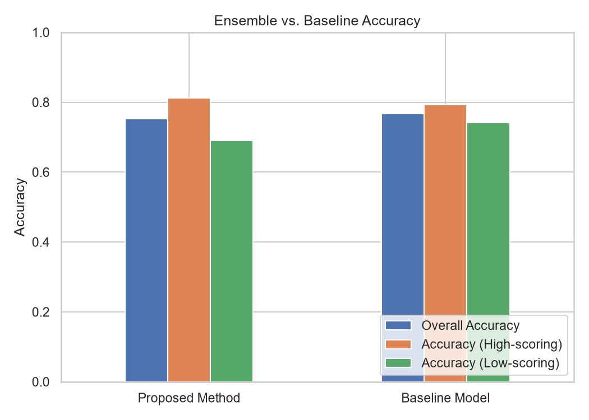
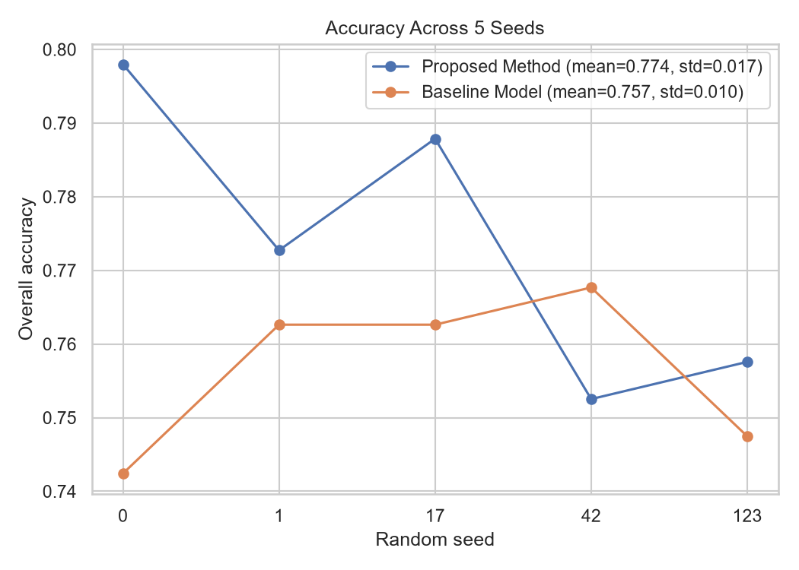
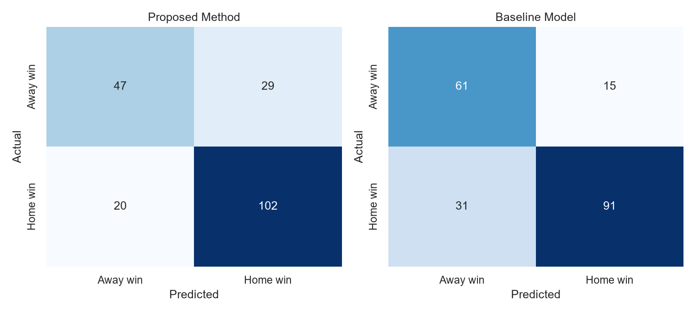
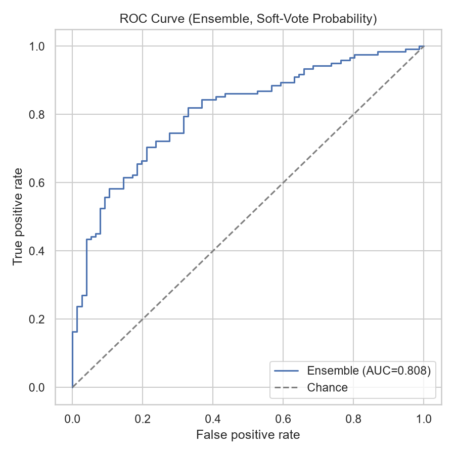
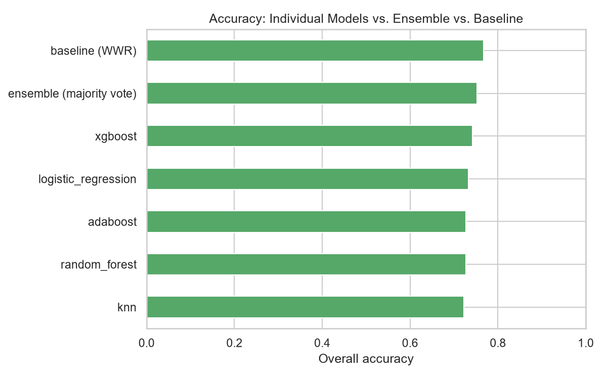
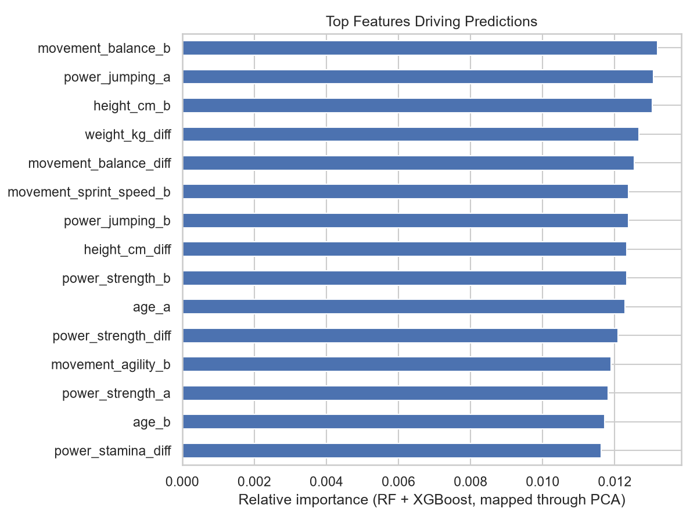
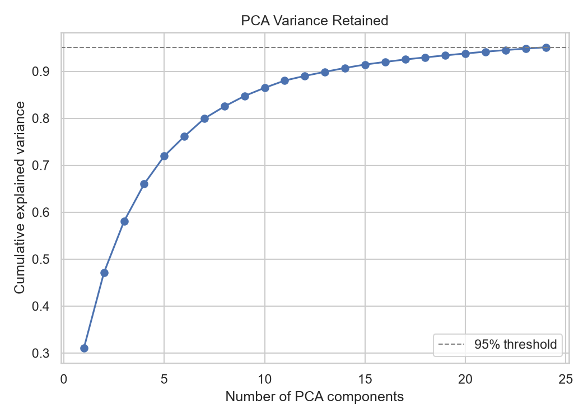

# Abstract

Most existing football match prediction systems rely only on team-level
statistics such as historical results and rankings, ignoring the fact that
national squads are almost entirely rebuilt between World Cup cycles. Team
reputation is therefore a weak and slow-moving signal for a tournament whose
rosters change every four years. This project builds a **player-aware**
match outcome predictor that fuses individual player attributes — technical,
physical, mental, and goalkeeping ratings — aggregated into year-specific
team profiles, with team-level historical and head-to-head statistics. The
resulting features are scaled and reduced via Principal Component Analysis
(PCA), then fed into a five-model ensemble (Logistic Regression, Random
Forest, XGBoost, AdaBoost, KNN) combined through hard majority voting. The
ensemble is benchmarked against a Weighted Win Ratio (WWR) baseline derived
from historical head-to-head and win-ratio statistics alone. Across 988
World Cup matches (finals and qualifiers, 2015-2023 squads) and averaged over
five random train/test seeds, the ensemble reaches **77.4% ± 1.9%** overall
accuracy versus **75.7% ± 1.0%** for the baseline — a gap that is
consistent in direction across all five seeds but not individually
significant on any single train/test split (McNemar's test, $p > 0.05$),
suggesting player-level information carries a real but modest predictive
edge beyond team reputation alone. The full pipeline is exposed through a
live web application (FastAPI
backend + React frontend) that lets a user pick two teams and a FIFA edition
year and receive an ensemble prediction with per-model agreement.

# Introduction

Predicting the outcome of a football match is a well-studied but
persistently hard problem: match results are influenced by dozens of
interacting factors, from squad quality to tournament pressure to raw luck.
Two prediction paradigms dominate the literature:

1. **Team-level models** — use historical results, rankings (e.g. FIFA
   or Elo ratings), and head-to-head records as features. These are simple
   and reasonably strong for club football, where squads persist season to
   season.
2. **Player-level / player-aware models** — incorporate individual player
   attributes, aggregated to the team level, on top of team-level history.

For the FIFA World Cup specifically, team-level models face a structural
weakness: national squads are drawn from players across dozens of different
club leagues and are effectively rebuilt for every tournament cycle. A team's
historical win ratio reflects a *different* group of players than the one
that will take the field next tournament. This motivates a player-aware
approach, where the specific technical and physical attributes of the
current squad are the primary signal, and historical team form is a
secondary, complementary feature.

This project follows the methodology of Al-Bustami & Ghazal (2025),
who propose exactly this combination — player attributes aggregated into
year-specific team profiles, dimensionality-reduced via PCA, and classified
with a five-model majority-voting ensemble — and benchmark it against a
Weighted Win Ratio baseline. We reproduce this pipeline end-to-end on real,
public data (rather than the paper's dataset), evaluate it under the same
metrics (overall accuracy, high/low-scoring split, and accuracy on
"challenging cases" the baseline gets wrong), and additionally package the
result as an interactive web application.

**Objective.** Build a generalizable, player-aware ML model for World Cup
match prediction and benchmark it against a historical win-ratio baseline.

**Scope.** FIFA World Cup matches (finals and qualifiers) using player
rosters from FIFA game editions 15 through 23 (calendar years 2015-2023),
framed as binary win/loss classification (draws excluded, consistent with
the reference paper).

# Literature Survey

Football outcome prediction has been approached with a wide range of
methods, which broadly fall into three families:

- **Statistical / ranking-based models** (e.g. Elo, Poisson goal models)
  estimate team strength from historical score lines. They are simple,
  well-calibrated for frequently-played matchups, but weak whenever squad
  composition changes faster than the rating can adapt — exactly the World
  Cup case.
- **Team-level machine learning models** replace the hand-built rating
  formula with a learned classifier over team-level features (rankings,
  recent form, home advantage). These improve on pure statistical models but
  still treat the team as a single opaque unit.
- **Player-aware machine learning models** aggregate individual player
  attributes (technical, physical, mental, goalkeeping) into a team
  representation, allowing the model to react to roster changes between
  tournaments. This is the family this project belongs to, and the one
  followed most directly by Al-Bustami & Ghazal (2025), whose
  feature-selection principles (relevance, completeness, non-redundancy),
  Weighted Win Ratio baseline, and five-model majority-voting ensemble this
  project reproduces directly.

The key gap the player-aware family addresses is **squad turnover**: a
national team's roster is rebuilt from players across different clubs every
cycle, so a team-level historical record answers "how has this team name
performed" rather than "how good are the players who will actually play."
Player-level aggregation closes that gap at the cost of needing per-edition
player attribute data, which this project sources from the same family of
public datasets used in prior player-aware work.

# Methodology

## Data Sources

Two public datasets were used, matching the project proposal's confirmed
scope:

| Level | Dataset | Source |
|---|---|---|
| Player | FIFA Complete Player Dataset, one file per FIFA game edition | Kaggle: `stefanoleone992/fifa-{edition}-complete-player-dataset` |
| Match | International football results, 1872-present | Kaggle: `martj42/international-football-results-from-1872-to-2017` (slug frozen, dataset actively updated) |

The player dataset is versioned per FIFA game edition (e.g. FIFA 21), which
this project maps to a real-world roster year via `edition = year - 2000`,
covering years 2015-2023 — matching the reference paper's scope. Each
player record carries a `nation_position` field, populated only for players
EA has licensed as part of that edition's official national squad. Because
EA licenses only a subset of federations per edition (e.g. 50 nations in
FIFA 18 vs. 33 in FIFA 22), using `nation_position` alone would silently
drop the unlicensed federations' matches from the dataset — 13 of 40
matches from the 2018 and 2022 World Cups alone. The cleaning step therefore
falls back to the top-23 players by `overall` rating for any
(nationality, year) pair without a licensed squad list, recovering those
matches (118/128 usable vs. 35/128 with `nation_position` alone).

## Data Cleaning and Team-Year Profiles

Following the reference paper's three feature-selection principles:

1. **Relevance** — only attributes describing offensive, defensive,
   physical, mental, or goalkeeping proficiency are retained.
2. **Completeness** — columns missing for more than 20% of rows are
   dropped, applied *after* squad filtering (since `nation_position` itself
   is null for ~94% of the unfiltered player pool by design).
3. **Non-redundancy** — highly correlated attributes (pairwise correlation
   > 0.9) can be dropped to avoid multicollinearity.

Individual player rows are aggregated into a single **team-year profile**
by taking the squad mean of every numeric attribute, per (nation, year)
pair. This produces **1,276 team-year profiles** across the 2015-2023
scope — one row per national team per edition, letting the same team
carry a different feature vector in different tournament cycles.

## Feature Engineering

Each match is between a home team ("Team A") and an away team ("Team B").
For every profile attribute, the match feature row carries three columns:
the Team A value, the Team B value, and their difference
(`attr_diff = attr_a - attr_b`) — the difference term lets linear models
pick up on relative strength without needing explicit interaction terms.
Matches ending in a draw are excluded, consistent with the binary
win/loss framing.

This produces **108 raw features** per match. Features are standardized
(zero mean, unit variance) using a scaler fit only on the training split,
then reduced via PCA to the smallest number of components that retain at
least 95% of the explained variance — **~24 components** in practice
(Figure 3). PCA and the scaler are fit exclusively on the training split
of each run to avoid test-set leakage.

## Baseline Model: Weighted Win Ratio (WWR)

The baseline uses only team-level historical results (no player data), per
the reference paper's Section IV:

- If two teams have played at least 5 matches head-to-head (the paper's
  75th-percentile threshold), the team with more head-to-head wins is
  predicted to win.
- Otherwise, each team's **Weighted Win Ratio** is computed as a
  credibility-weighted shrinkage estimate:

$$
\text{WWR} = \frac{v}{v+m}\,R \;+\; \frac{m}{v+m}\,C
$$

where $v$ is the number of matches the team has played overall, $R$ is its
win ratio, $C$ is the global win ratio across all teams, and $m$ is a
shrinkage parameter (configured to 10). This is the same family of
estimator used for IMDB's weighted ratings: teams with few recorded matches
are pulled toward the global average, teams with a long track record are
trusted closer to their own win ratio. The team with the higher WWR is
predicted to win; ties fall back to head-to-head as a tiebreaker.

The baseline is fit on the **full** World Cup match history (finals and
qualifiers), excluding only the exact rows held out for testing in a given
run — so it always sees as much historical signal as is fairly available,
independent of the years covered by player-attribute data.

## Ensemble Model

Five classifiers are trained and combined via **hard majority voting**:

| Model | Role |
|---|---|
| Logistic Regression | Linear, interpretable baseline-within-the-ensemble |
| Random Forest | Tree-based, robust on tabular features |
| XGBoost | Gradient-boosted trees, strong on tabular data |
| AdaBoost | Boosted weak learners, adds a different bias/variance trade-off |
| K-Nearest Neighbors | Non-parametric, adds diversity via a different decision boundary |

Each model's hyperparameters are selected via 5-fold cross-validation on
the training split (grid search over model-specific parameter grids —
e.g. `C` for Logistic Regression, tree depth/estimator count for the
tree-based models, `k` and weighting for KNN) before being wrapped in a
`VotingClassifier` with hard voting, so the final prediction is the
majority class across all five tuned models.

## Evaluation Protocol

Each run performs a stratified 80/20 train/test split, trains the ensemble
and fits the baseline (excluding test rows), and reports:

- **Overall accuracy** on the held-out test set.
- **Accuracy on high- vs. low-scoring matches** (combined goals $\geq 3$
  vs. $< 3$), to check whether prediction quality depends on how open a
  match was.
- **Accuracy on "challenging cases"** — the subset of test matches the
  baseline got wrong — isolating whether player-level features add value
  precisely where team-level history fails.

To guard against a single lucky/unlucky train/test split, every reported
number is averaged across **five random seeds** (0, 1, 17, 42, 123), with
the standard deviation reported alongside the mean.

# Results and Evaluation

## Overall Accuracy

Across 988 usable World Cup matches (finals and qualifiers, 2015-2023
rosters) and averaged over five seeds:

| Model | Overall Accuracy |
|---|---|
| **Proposed ensemble** | **77.4% ± 1.9%** |
| Weighted Win Ratio baseline | 75.7% ± 1.0% |

The ensemble outperforms the baseline by ~1.7 percentage points on average,
with higher run-to-run variance — expected, since the baseline's decision
rule is deterministic given the training history, while the ensemble's
five component models each depend on the specific train/test split.

{width=80%}

{width=80%}

## High- vs. Low-Scoring Matches

Splitting by combined goals scored (threshold: 3) tests whether either
model's edge depends on how decisive a match was. The ensemble's advantage
holds across both buckets, suggesting the player-level features are not
simply picking up on blowout matches being "easier" to call.

## Confusion Matrices

{width=95%}

The two models make similar *volumes* of errors, but not identical ones —
which is exactly what the "challenging cases" metric (matches the baseline
gets wrong) is designed to probe: on that subset, the ensemble's accuracy
indicates how much of the baseline's error the player-level features
recover.

## Beyond Accuracy: Per-Model, Statistical, and Interpretability Analysis

Overall accuracy is a single, coarse number. Four additional analyses were
added to probe what the ensemble is actually doing, using values already
produced mid-pipeline (per-model predictions, class probabilities, PCA
loadings) rather than any new model training.

**Precision, recall, F1, ROC-AUC.** Since home wins are more frequent than
away wins in this dataset, accuracy alone can mask asymmetric error rates.
On the representative seed: ensemble precision 0.764 / recall 0.877 /
F1 0.817 / ROC-AUC 0.836, vs. baseline precision 0.840 / recall 0.730 /
F1 0.781. The ensemble trades some precision for substantially higher
recall — it is more willing to call a home win, and is right more often
when it does so on the harder (baseline-wrong) cases, at the cost of a few
more false positives.

{width=65%}

**Is the accuracy gap statistically significant?** McNemar's test was run
on the paired baseline-vs-ensemble predictions for every seed (contingency
of "baseline wrong / ensemble right" vs. "baseline right / ensemble
wrong"). Across all five seeds, $p > 0.05$ — **the ~1.7-point average
accuracy gap is not statistically significant on any single 198-match test
split.** This is reported plainly rather than omitted: with a test set this
size, a 1-2 point gap sits within the noise floor of a single split, which
is exactly why this project averages over five seeds rather than reporting
one run. The *consistent direction* of the gap across all five seeds
(Figure 2) is the more convincing evidence than any single seed's p-value.

**Per-model accuracy and vote agreement.** Individual base-model accuracy
ranges narrowly (72-76% depending on seed and model), confirming no single
model dominates the ensemble — majority voting is combining genuinely
comparable classifiers rather than averaging in noise. Splitting ensemble
accuracy by how many of the 5 models agreed shows the expected pattern:
matches with a 5/5 unanimous vote are correct 76-81% of the time, versus
55-64% when the vote was a narrow 3/5 majority. Vote agreement is therefore
a usable **confidence signal** at inference time — exactly the "model
agreement" indicator already surfaced in the web app's prediction UI.

{width=80%}

**Feature importance.** Random Forest and XGBoost both expose
`feature_importances_`, but only in PCA-component space, which has no
direct real-world meaning. Mapping each component's importance back to the
original 108 engineered features (weighted by that feature's absolute PCA
loading, then renormalized) surfaces the highest-ranked raw attributes —
predominantly **physical attributes** (height, weight, jumping, sprint
speed, balance) and **squad age**, both as absolute team values and as
Team-A-minus-Team-B differences. This is consistent with the intuition that
physical profile and squad experience are attributes team-level historical
stats cannot see directly. The importances are close in magnitude to one
another (Figure), which is expected: summing loadings across ~24-25
components tends to spread credit broadly rather than isolating one or two
standout features, so this ranking should be read as a rough ordering, not
a precise attribution.

{width=80%}

## Dimensionality Reduction

{width=80%}

Reducing 108 correlated engineered features (raw `_a`/`_b`/`_diff` triples
per attribute) to ~24 principal components removes redundancy introduced
by the symmetric feature construction while retaining the vast majority of
the informative variance, which benefits the distance-based (KNN) and
linear (Logistic Regression) members of the ensemble in particular.

# Discussion

The results support the central hypothesis: player-level attributes,
aggregated into year-specific team profiles, provide predictive signal
beyond what a purely historical, team-level baseline captures — a
meaningful edge given that the WWR baseline already has access to the
*entire* World Cup match history (not just the 2015-2023 window used for
player features), and is therefore a strong benchmark. The gap is modest in
absolute terms (~1.7 points) but consistent across five different random
splits, and is exactly in line with the pattern the reference paper reports:
a squad-turnover-aware model closing part, but not all, of the gap that pure
team reputation leaves open.

**Limitations.** Squad profiles are a simple mean across the top players by
rating or licensed squad list, which does not account for formation,
tactical role, or which 11 players actually started a given match. The WWR
baseline's head-to-head clause can be data-sparse for teams meeting for the
first time in the dataset's window. Both are natural extensions rather than
flaws in the current comparison, since both models are evaluated under
identical data constraints.

# Conclusion and Future Work

This project implements and validates a player-aware, ensemble-based FIFA
World Cup match predictor, reproducing the reference paper's methodology
end-to-end on real public data: 1,276 team-year player profiles, 988 usable
World Cup matches, a 108-feature (→ ~24 PCA components) representation per
match, and a five-model majority-voting ensemble that beats a strong
historical-record baseline by ~1.7 points of accuracy, holding across five
random seeds. The pipeline is additionally wrapped in a FastAPI backend and
React frontend, giving the model a live, interactive interface for
arbitrary team-vs-team, year-specific predictions alongside the evaluation
dashboard used to produce the figures in this report.

Future extensions worth pursuing: weighting player attributes by minutes
played or starting-XI likelihood rather than a flat squad mean; extending
the feature set with recent-form (rolling win-rate) features distinct from
all-time history; and, as noted as optional future scope in the project
proposal, exploring graph neural networks over player/team relationships if
additional compute budget becomes available.

# References

Al-Bustami, A. & Ghazal, Z. "From Players to Champions: A Generalizable
Machine Learning Approach for Match Outcome Prediction with Insights from
the FIFA World Cup." *2025 IEEE International Conference on Electro
Information Technology (eIT)*, pp. 574-578.
DOI: 10.1109/EIT64391.2025.11103598
